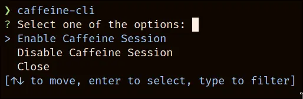

# ☕ Caffeine Cli

Just another caffeine tool, but this one should work. It uses systemd inhibit to manage the idling part.

# TO-DO

- Make it a library
- Add timed session

# How To Install

To install run:

```bash
cargo install --git https://github.com/lighttigerXIV/caffeine-cli.git
```

Alternatively you can manually download the release binary in the [releases](https://github.com/lighttigerXIV/caffeine-cli/releases) page

# Commands

You can run the following commands:

`caffeine-cli {command}`

| Command | Description                   |
| ------- | ----------------------------- |
| enable  | Starts a new caffeine session |
| disable | Ends the caffeine session     |

Alternatively you can run the app and select the option:


