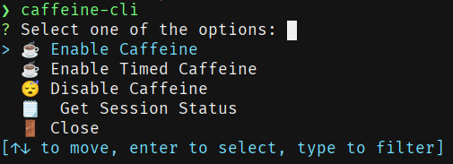

# ☕ Caffeine Cli

Just another caffeine tool, but this one should work. It uses systemd inhibit to manage the idling part.

# How To Install

To install run:

```bash
cargo install caffeine-cli
```

Alternatively you can manually download the release binary in the [releases](https://github.com/lighttigerXIV/caffeine-cli/releases) page.

# Usage

To install it as you can use cargo to add it or manually add the library in cargo.toml:

```bash
cargo add caffeine-cli
```

To add it in the cargo.toml:

```toml
caffeine-cli = "1.0.1"
```

You can also use this as a library:

To start and get a session you can use the init_session command:

```rust
// Starts an endless session
let session = init_session(None).unwrap();

// Starts with a protected session (no other sessions can be created if there's an active session)
let session = init_protected_session(None).unwrap();

// For a timed session (seconds)
let session = init_session(Some(4 * 60)).unwrap();

// Starts with a timed protected session
let session = init_protected_session(Some(4 * 60)).unwrap();
```

To end a session:

```rust
// Ends the given session
end_session(session);

// Ends the current protected session
end_protected_session();
```

# Commands

You can run the following commands:

`caffeine-cli {command}`

| Command | Description                                                   |
| ------- | ------------------------------------------------------------- |
| enable  | Enables the caffeine session with an infinnite amount of time |
| timed   | Enables the caffeine session with x amount of minutes         |
| disable | Disables the current session                                  |
| status  | Shows the status of the current session                       |

Alternatively you can run the app and select the options in the menu:


